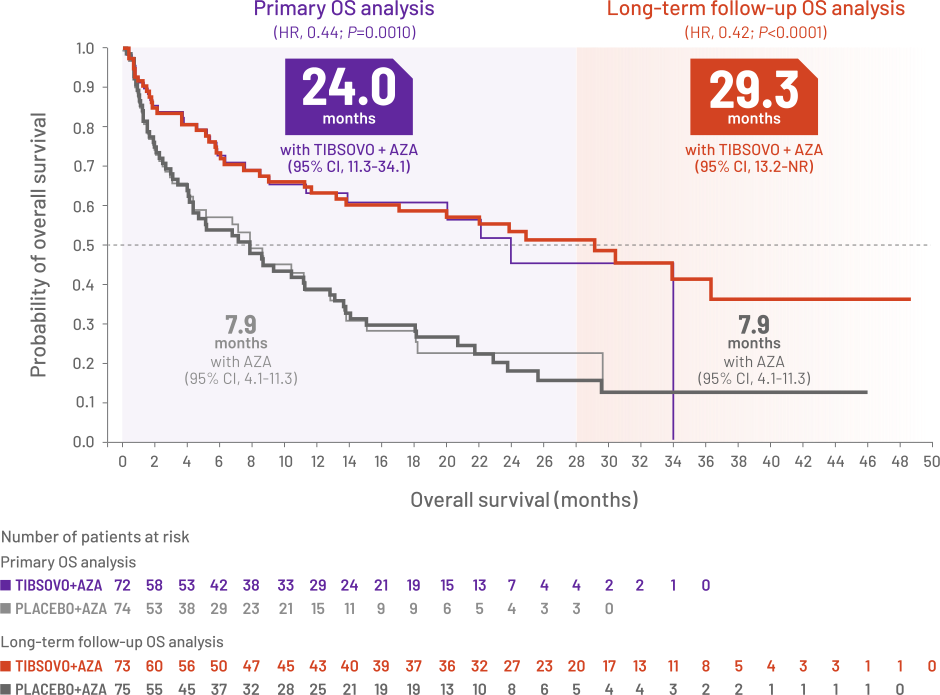

```{r load-packages, include = FALSE}
# Add any additional packages you need to this chunk
library(tidyverse)
library(tidymodels)
library(palmerpenguins)
library(knitr)
library(xaringanthemer)
```

```{r setup, include=FALSE}
# For better figure resolution
knitr::opts_chunk$set(fig.retina = 3, dpi = 300, fig.width = 6, fig.asp = 0.618, out.width = "80%")
```

```{r load-data, include=FALSE}
# Load your data here
```

```{r ,echo=F}
style_xaringan(
  title_slide_background_image = "img/biostats-background.png",
  title_slide_text_color =  "#d6d6d6", 
  inverse_background_color = "#1B2360",
  base_font_size = "26px", 
  text_color = "#1B2360", 
  header_color = "#1B2360"
)
```


class: inverse, center, middle

# My Background

---

# My Path 

- BA in Math/ Adolscent Education - Houghton (2004)
- MS in Math - South Dakota State University (2010)
- AM in Biostatistics - Harvard University (2012)
- PhD in Biostatistics - Harvard University (2015)
- Assistant Professor at Brown University (2015-2020)
- Senior Principal Biostatistician - Servier Pharamceuticals (2021-Present)
  

---

class: inverse, middle, center

# What is Biostatistics? 

---

# Biostatistics

- Biostatistics is a scientific field of its own. 
- It focuses specifically on:
    - Study Designs for Human Subjects Data. 
    - Models for Biological Data
    - Real life medical Experiments and trials. 


---

# What Makes Biostatistics Different? 

- Many times theory in sciences is developed by people trying to push the limits and think beyond what is seen and done. 
- In mathematics and theoretical statistics this can mean that you develop theory for which there is no current or foreseeable application. 
- Biostatistics theory is typically drive by unique study designs or data isses. 

---

# Why Biostatistics? 

- Every bit of research done in Biology and Medical field uses these techniques and theory. 
- You can work with any research that you find interest in. 
- For Example (My own past/current work):
    - Religion and Public Health
    - Pediatric Health
        - Asthma Research
        - Prenatal/Eary childhood health impacts on education
    - Psychology Research
    - Pharmaceutical Research
        - Gastro-intestinal (Chrohns, Ulcerative Colitis)
        - Oncology (AML, CCA, Colorectal Cancer, ...)

---


class: inverse, middle, center

# Academic vs Pharmaceutical Medical Research 

---

# Academic Medical Research Motivations

- A lot of medical research is done by universities. 
- Main motivators for Academic Research
    - Topic of interest to researcher. 
    - Increase knowledge on areas of research. 
    - Publications in medical journals. 
    - Future grants for future research. 


---


# Pharmaceutical Medical Research Motivations

- A lot of medical research is done by universities. 
- Main motivators for Pharmaceutical Research
    - Topic of interest to company. 
    - Advance treatments currently available. 
    - Improve patient lives. 
    - Sell more treatments. 
    


---


# Major Differences in Academic and Pharmaceutical Research

- Academic research has more freedom. 
    - Governed by peer reviewers. 
    - If one journal doesn't like it, another one most likely will. 
- Greater amounts of time
    - Harvard has many cohort studies where they follow people for decades and are just able to collect certain data. 
    - Planning a study can take years 
- Not much research into treating diseases. 
- Mostly interested in policy or prevention. 

---


# Major Differences in Academic and Pharmaceutical Research

- Pharmaceutical Research is highly Restricted. 
    - Controlled by the FDA, EMA, ...
    - Statistical Models have to be agreed upon before data is ever seen. 
    - Data has a strict design and coding must be done so that agencies and replicate it all. 
- Time is very limited. 
    - Design studies in under 1 year. 
    - results typically due months after end of study. 
- Mostly interested in treatments/Cures

---


class: inverse, middle, center

# Statistics in  Medical Research

---

# Statistics in Medical Research

- Well designed studies include statistics from the start. 
- Play a strategic role in decisions:
    - Sample Size 
    - Type of Data needed to answer questions. 
    - Best methods for questions. 
    - Checks and Balances on Data
    - Strategies for Starting and Stopping Studies

---

# Academic Case Study: TMIST Clinical Trial

- Tomosynthesis Mammographic Imaging Screening Trial (TMIST)
- Compares 2D to 3D mammographies
- 165,000 Women enolled


---

# TMIST  Sample Size Considerations

- Why the large sample size:
    - Likelihood of advanced breast cancer in 4.5 years is low. 
    - Sample Size high to be more likely to detect differences. 

---

# TMIST Innovations

1. Typical endpoint is mortality. TMIST uses Occurence of Advanced Cancer. 
2. Rich Data Collection of Biospecimens
    a. Specimens of cancers
    b. Blood and saliva Samples. 
3. TMIST large database of imaging scans for future use. 

---

# TMIST Statistical Challenges

- Large scale image analysis and comparison.
- Models including genetic, biological and imaging data. 
- Massive qunatities of data being compared. 
- Necessary model development. 
- Computer programming and equipment. 


---

# Pharmaceutical Case Study: AGILE Trial (Tibsovo) 

- Compares
    - Azacitidine (Standard of Care)
    - Ivosidenib + Azacitidine
- 146 patients
    - 74 in Azacitidine
    - 72 in Ivosidenib + Azacitidine


---

# AGILE Overall Survival in AML

```{r echo=FALSE, out.width='60%'}

```

---

# AGILE Statistical Considerations

- Stopped enrollment early for massive increase in OS. 
- Current Modeling done to ensure proper marketing and future authorizations .
- Health Economics Research
- Design of Clinical Trial using Real world evidence

---


# Shiny App for 


- [Go to Shiny APP]("https://rsc.axe.prod.df.servier.com/content/f830d832-d7c0-4ba3-ab70-e35aaa49194c/")


